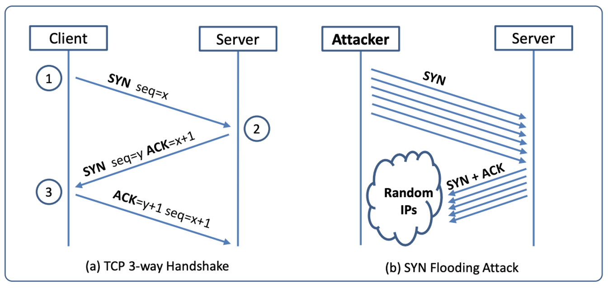

## TCP Sync Flood Attack
SYN flood is a form of DoS attack in which attackers send many SYN requests to a victim’s TCP port, but the attackers have no intention to finish the 3-way handshake procedure. Attackers either use spoofed IP address or do not continue the procedure. Through this attack, attackers can flood the victim’s queue that is used for half-opened connections, i.e. the connections that has finished SYN, SYN-ACK, but has not yet gotten a final ACK back. 

### Tools
1. Pre-built Virtual Machine Images (Ubuntu)
2. Netwox is installed under Linux, Windows, FreeBSD, OpenBSD and Solaris. It consists of a suite of tools, each having a specific number. You can also find more about the tool utility by using below commands :
		 $ netwox toolnumber  - -help 	or	 $ netwox toolnumber  - - help2	
           In this experiment: Toolnumber = 76
           
3. Wireshark :  It is GUI based network packet analyser.  We can also use wireshark(on observer machine) to observe open TCP connections by giving appropriate filters.

4. netstat : Displays active TCP connections, ports on which the computer is listening, Ethernet statistics, the IP routing table, IPv4 statistics (for the IP, ICMP, TCP, and UDP protocols), and IPv6 statistics (for the IPv6, ICMPv6, TCP over IPv6, and UDP over IPv6 protocols). Used without parameters, netstat displays active TCP connections.

### Performing the Attack
In this task, you need to demonstrate the SYN flooding attack. You can use the Netwox tool to conduct the attack, and then use a sniffer tool to capture the attacking packets. While the attack is going on, run the "netstat -na" command on the victim machine, and compare the result with that before the attack. 

1. Step 1: Use Netwox Tool 76 as below : *netwox 76 - - dst-ip “x.x.x.x” - - dst-port “80”*

2. Step 2: We can use command *"netstat -na"* to check the usage of the queue, i.e., the number of half-opened connection associated with a listening port. The state for such connections is SYN-RECV. If the 3-way handshake is finished, the state of the connections will be ESTABLISHED.

3. Step 3: Alternatively, we could use wireshark to observe the open TCP connections on the observer’s machine.

*Hint: All machines are in one LAN*

### Countermeasure
SYN Cookie Countermeasure: SYN cookie is a defense mechanism to counter the SYN flooding attack.	You can use the sysctl command to turn on/off the SYN cookie mechanism:
    *sudo sysctl -a | grep cookie (Display the SYN cookie flag)*
	  *sudo sysctl -w net.ipv4.tcp_syncookies=0 (turn off SYN cookie)*
	  *sudo sysctl -w net.ipv4.tcp_syncookies=1 (turn on SYN cookie)*

